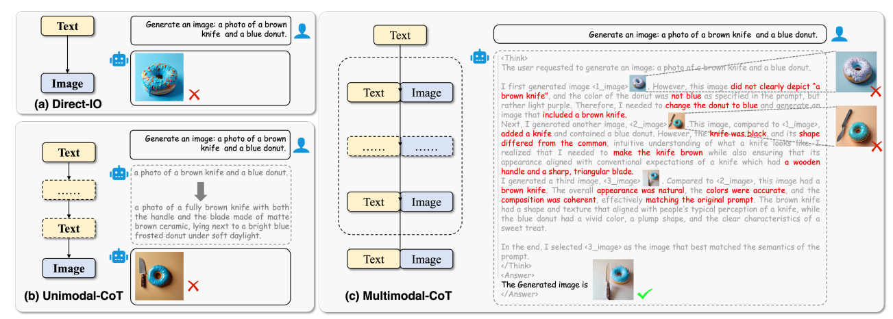

<div align="center">

<h1> [NeurIPS 2025] Vinci: Deep Thinking in Text-to-Image Generation using Unified Model with Reinforcement Learning </h1>


<h5 align="center"> 
<a href='https://neurips.cc/virtual/2025/loc/san-diego/poster/116284'></a>
<a href='https://huggingface.co/datasets/ttr12138/Vinci'>


</h5>
</div>


## 📢 News
- [x] **`Nov 11, 2025.`** We release our training data for cold-start stage.


##  📸 Overview


With the continuous development of large language models and reasoning chain technologies, the potential of deep reasoning based on reinforcement learning has shown remarkable promise in multi-task scenarios. However, existing unified models have yet to achieve end-to-end integration in image generation and understanding tasks, limiting the model’s self-reflection ability and the realization of cross-modal reasoning chains. To address this, we propose Vinic, a novel framework designed to enable interleaved image generation and understanding through deep reasoning capabilities. We leverage a small amount of multimodal chain-of-thought (MCoT) data for cold-start and employ reinforcement learning to guide the integration of image generation and understanding tasks. Additionally, we introduce a momentum-based reward function, which dynamically adjusts the reward distribution by considering historical improvements, ensuring the stability of the model across multiple generations. Experimental results demonstrate that integrating MCoT can achieve a +22% improvement over the base model on Geneval, effectively enhancing both image generation quality and instruction alignment capabilities.


## ⚙️ Installation


```bash
# TODO
```

## 🚀 Inference


```bash
# TODO
```


